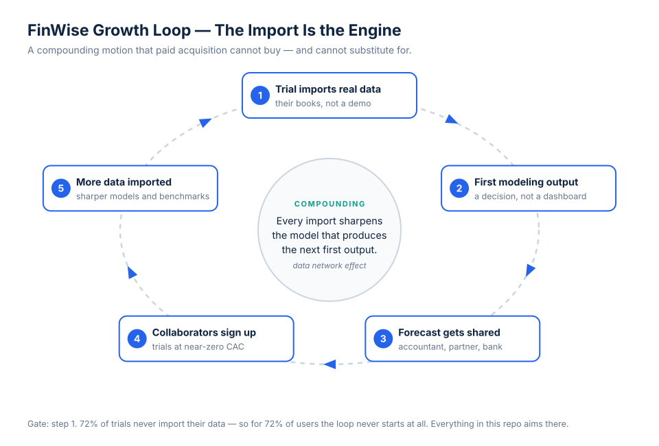

# The Bet · FinWise

> Module 1 · Ignite a PLG Motion. The growth hypothesis and where we're betting, plus the growth-loop visualization.

## The scenario

FinWise Co. is a B2B SaaS company selling financial-management software to small businesses. It has reached product-market fit, runs a product-led motion with a **reverse trial**, and wants to grow hard over the next year. Today:

| | |
|---|---|
| ARR | **$10M** |
| Trial → paid conversion | **2%** |
| One-year retention, paid customers | **40%** (60% churn) |
| Growth engine | Mostly **paid acquisition** to drive trial sign-ups |
| Problem | More acquisition spend **no longer drives meaningful growth** |

## My hypothesis

> **I think FinWise's biggest problem is that trial users never reach the moment the product proves itself — importing their own financial data — so the trial expires having modelled nobody's business, and 98% of them leave without ever seeing FinWise work on their numbers.**

### The evidence behind the hunch

1. **2% conversion on a *reverse* trial is the tell.** A reverse trial hands over full functionality up front. When users have already been given everything and still don't buy, the constraint is not access, price, or feature depth — it is that value never landed. A pricing problem cannot explain a 2% conversion rate on a product the user already had for free.

2. **40% one-year retention says the same thing again, later in the lifecycle.** If 60% of *paying* customers churn within a year, value isn't merely hard to discover during the trial — it isn't becoming habitual afterwards either. The same underlying failure shows up twice: users are not repeatedly experiencing the thing the product is for.

3. **Diminishing returns on paid acquisition are the symptom, not the disease.** Adding spend to a funnel that converts at 2% raises CAC without raising growth. The constraint sits *downstream* of acquisition, which is exactly why more money at the top has stopped working.

## The bet

**We bet on the data import — getting trial users to model their own business — and we stop treating acquisition as the growth lever.**

| Bet | Module | What it buys |
|---|---|---|
| Rebuild the trial's first session around importing real data and producing one modelling output | M2 | Moves the gate itself |
| A weekly refresh habit so the modelling output is a recurring event, not a one-off | M3 | Turns activation into retention |
| Make "reached first modelling output" the North Star and instrument the path to it | M4 | Makes the bet measurable |
| One clean A/B test on the onboarding change before rollout | M5 | Keeps us honest |
| Re-time the reverse trial to activation rather than the calendar | M6 | Fixes the model without touching the gate |

**The one thing I would test first:** whether restructuring the trial's first session around the data import — rather than around product exploration — lifts the share of trials that import within 48 hours. It's the top of the causal chain, it's cheap to test, and every other bet depends on it being true.

### What we are deliberately not doing

- **Not increasing paid acquisition.** The scenario already tells us it has stopped working. Buying more trials at 2% conversion buys more of the same problem.
- **Not discounting to force conversion.** Users who never saw the product work won't be persuaded by a cheaper version of a thing they haven't valued. Discounting a 2% funnel damages ARPU and leaves the cause untouched.
- **Not adding new feature surfaces.** FinWise has PMF. The problem is that most trial users never reach the features that already exist.
- **Not building a sales team to rescue trials.** That's a real option for B2B, but it converts a product problem into a permanent cost line, and it doesn't compound.

## Growth loop

**Why this compounds.** Step 5 is what makes it a loop rather than a funnel bent into a circle: every imported dataset improves FinWise's transaction categorisation and its benchmarks, so the *next* user's first modelling output arrives faster and reads sharper. And step 3–4 is the B2B distribution engine — small-business owners forward cash forecasts to accountants, co-founders and banks, and accountants carry the product to their whole client book. That's acquisition FinWise cannot buy with ad spend, which is precisely why paid spend has plateaued.

**Where the loop breaks.** At step 1. 72% of trials never import their data, so for nearly three-quarters of users the loop never begins. Everything else in this repo aims at that step.

## What would prove me wrong

1. **If trials that reach a first modelling output converted at roughly the same rate as those that don't**, the import isn't the constraint and the problem really is pricing or fit. *(M4: 8.3% vs 0.2% — a 40× gap. It doesn't hold.)*
2. **If imports trickled in across the whole trial window**, the lever would be lifecycle email rather than the first session. *(M4: 71% of trials that ever import do so in session one. It doesn't hold.)*

Both checks are in [`04-signals/`](../04-signals/data-signals.md), and both came back in favour of the bet — which is the only reason it survives into M5.
