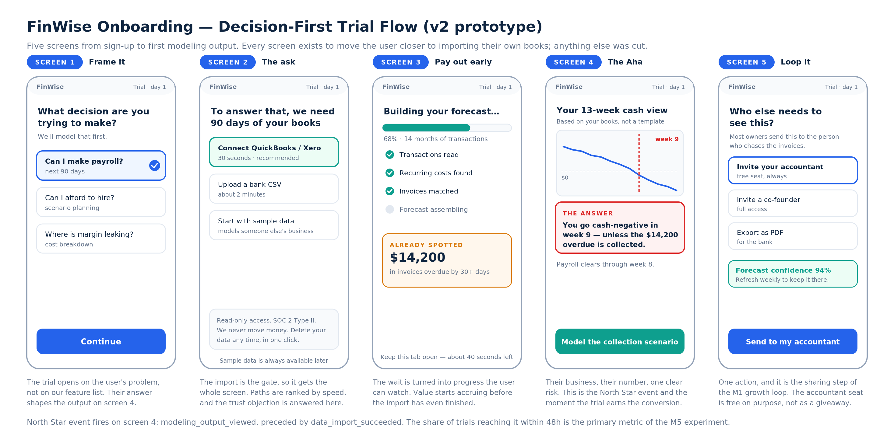

# The Solution · FinWise

> Module 2 · Acquisition & Activation. The onboarding prototype that gets a new trial user to the Aha moment as fast as possible, and the Aha definition itself.

## Aha moment

In the user's words: **"It modelled *my* business and told me something I didn't already know."**

Instrumented definition:

> A trial user **imports their own financial data** and **views their first modelling output** — within **48 hours** of trial start, target median under **10 minutes**.

This is deliberately the same event as the M4 North Star. The Aha, the North Star and the primary experiment metric are one behaviour, so the strategy cannot drift between modules.

### Why this definition and not a softer one

An Aha is only useful if it *discriminates* — if users who reach it behave differently from users who don't.

| Candidate | Reach | Trial → paid | Verdict |
|---|---|---|---|
| Completed account setup | 76% | ~2% | Almost everyone does it and it predicts nothing. |
| Invited a teammate | 6% | 11% | Strong signal, but it happens *after* belief. Effect, not cause. |
| Explored 3+ features | 31% | 3.1% | Measures curiosity, not value. Easy to game with a product tour. |
| **Imported data + first modelling output, ≤48h** | **22%** | **8.3%** | **40× the non-reaching cohort. This is the moment.** |

The winner isn't the metric that looks best on a slide — it's the one that splits the population. Optimising "explored 3+ features" would have produced a beautiful product tour and no revenue.

## Onboarding prototype

Five screens, sign-up to Aha. Every screen that didn't move a user toward the import was cut — including the feature tour, the team-invite step and the plan selector, all of which now happen after the first modelling output.

| # | Screen | The move | The mechanism |
|---|---|---|---|
| 1 | **Frame it** | Ask what decision they're trying to make before asking for anything | The output on screen 4 answers *their* question, so the import has an obvious purpose |
| 2 | **The ask** | The import gets a whole screen; paths ranked by speed; trust objection answered in place | The gate deserves the real estate. Handing over company financials is a trust decision, not a form |
| 3 | **Pay out early** | Progress made visible, plus one insight found mid-sync ("$14,200 overdue") | Value begins accruing before the import finishes, so the wait builds belief instead of doubt |
| 4 | **The Aha** | A 13-week cash view on their books with one flagged risk and one recommended action | A decision, not a dashboard. This is where the trial earns the conversion |
| 5 | **Loop it** | One action: send it to the accountant | Step 3 of the M1 growth loop, placed at peak enthusiasm |

### v1 versus v2

| Today (v1) | Proposed (v2) |
|---|---|
| Sign-up → feature tour → empty workspace | Decision → import → partial value → output → share |
| Import buried in settings, framed as configuration | Import is the trial's headline task |
| Sample data offered first (safe, and fatal) | Sample data offered last, honestly labelled as someone else's business |
| Trust concerns unaddressed until the user searches for them | Security answered at the exact moment of the ask |
| Ends on a workspace the user must figure out | Ends on a number about their business and one action |

## Why this activates

1. **The import is treated as the product, not as setup.** In v1 it competes with a feature tour for attention. In v2 nothing competes with it.
2. **Purpose precedes effort.** Screen 1 costs the user nothing and makes screen 2's ask legible: you're not "connecting an integration," you're answering *can I make payroll*.
3. **The trust objection is met where it's felt.** For an SMB owner, handing over the books is the real barrier — bigger than the clicks. Read-only, SOC 2, one-click delete, stated at the point of hesitation rather than in a footer.
4. **Sample data is deliberately demoted.** Offering it early is the single most tempting mistake here: it lifts "users who saw a forecast" and destroys conversion, because a forecast of someone else's business proves nothing. It stays available, ranked last, honestly described.
5. **The output is a decision.** "You go cash-negative in week 9 unless the $14,200 overdue is collected" is worth paying for. A dashboard is not.

## Open item

These are static specification screens. If a clickable prototype is wanted alongside, the five screens are specified tightly enough to build directly in a vibe-coding tool or Figma, and the link belongs here.
