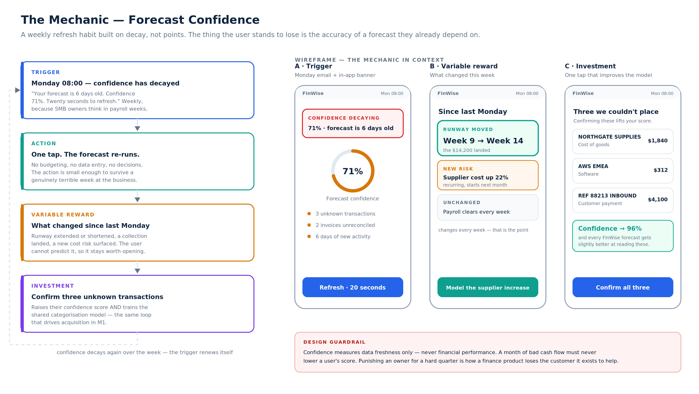

# The Mechanic · FinWise

> Module 3 · Retention & Engagement. One gamification mechanic that turns the Aha-predicting behaviour into a habit, with rationale and wireframe.

## Pre-work: three questions that drove every decision here

**1. What behaviour was the M2 flow designed to get users to?**
Importing financial data and reaching a modelling output. The repeatable version of that behaviour is **refreshing the forecast on current data** — the same act, performed again.

**2. How often would a user naturally perform it?**
**Weekly.** Not daily — an SMB owner has no daily reason to re-forecast, and a daily trigger would fire with nothing behind it and train users to ignore it. Not monthly — too slow to become a habit inside a trial, and cash decisions (payroll, collections, supplier terms) move on a weekly rhythm. Weekly matches how the customer already thinks.

**3. What would losing progress actually feel like?**
This is the question that killed the obvious answer. A points streak would feel like losing *nothing*, because an owner under cash pressure does not care about a badge. But letting the forecast go stale feels like **losing the reliability of something they've started depending on** — the number they quote to their co-founder is now six days out of date. That's a real loss, so the mechanic is built on it.

## The mechanic: **Forecast Confidence**

A live score on the user's forecast that **decays as their data goes stale**, and is restored in one tap.

| Habit loop stage | Implementation | Design reasoning |
|---|---|---|
| **Trigger** | Monday 08:00 email + in-app banner: *"Your forecast is 6 days old. Confidence 71%. Twenty seconds to refresh."* | External at first, then internal — Monday becomes "check the cash view." The trigger carries the payload, so it's informative even unopened. |
| **Action** | One tap re-runs the forecast on current data. | Small enough to survive a bad week. The action is *refreshing*, never budgeting or data entry. |
| **Variable reward** | What changed since last Monday: runway moved, a collection landed, a new cost risk appeared, or nothing did. | Unpredictable by construction. A fixed reward stops being worth opening by week three. |
| **Investment** | Confirm two or three transactions FinWise couldn't categorise. | Raises their score *and* trains the shared categorisation model — the compounding step of the [M1 loop](../01-bet/growth-bet.md). |

**Why a decaying score rather than a streak.** A streak is binary and unforgiving: break it once and the mechanic is dead, and re-earning it feels pointless. A confidence score degrades gradually and recovers immediately, so a user who misses two weeks has a 20-second path back rather than a lost record. Loss aversion still does the work — it's just attached to something the user actually values.

## Wireframe

## Rationale

**Why this addresses the 40% retention problem specifically.** M4 shows one-year retention splits 62% versus 24% depending on whether a customer ran three or more modelling outputs in month one. Retention isn't decided at renewal — it's decided by whether the product became a weekly fixture in the first few weeks. This mechanic exists to manufacture exactly that cadence, and it starts during the trial rather than after conversion.

**Why the investment step is transaction confirmation.** It has to take one tap, visibly improve the user's own output, and feed something larger. Categorisation does all three, and it's the only investment available that compounds across the whole customer base.

**Where the mechanic sits relative to the paywall.** Entirely inside the reverse trial and the free experience. Per the M1 bet, the habit is built before anything is charged for — and per [M6](../06-model/pricing-model.md), the paywall is placed after the habit exists, never on top of it.

## Metrics for the mechanic

| Type | Metric | Target |
|---|---|---|
| Leading | Weekly refresh rate among activated trials | > 50% in week 1 |
| Leading | Investment-tap rate per refresh | > 35% |
| Leading | Median forecast confidence at day 30 | ≥ 85% |
| Lagging | Share of paid customers running ≥3 outputs in month 1 | 42% → 60% |
| Lagging | One-year paid retention | 40% → 55% |
| Guardrail | Weekly email unsubscribe rate | must not exceed 4% |
| Guardrail | Trial cancellations within 24h of a Monday trigger | no increase vs baseline |

The guardrails exist because the failure mode of any notification-driven mechanic is that it moves its own metric while quietly burning the permission it runs on.

## Design guardrail

**Confidence measures data freshness only — never financial performance.** A customer having a terrible cash quarter must never see their score fall because of it. Gamifying business outcomes in a finance product means punishing owners at the exact moment they most need the tool, and it is the fastest way to lose the customer the product exists to help.

## Known risks

- **Trigger fatigue in a quiet business.** If nothing has changed for weeks, the reward card is hollow. Mitigation: the card falls back to a comparative read ("steadiest four weeks since you joined"), so it's never blank.
- **Confidence gaming.** Users could refresh without confirming anything to keep the number high. That's acceptable — the refresh *is* the habit; categorisation is the bonus.
- **Accountant-managed accounts.** Where a bookkeeper owns the data, the trigger should route to them while the owner keeps the output. Otherwise the mechanic nags the person who can't act on it.
