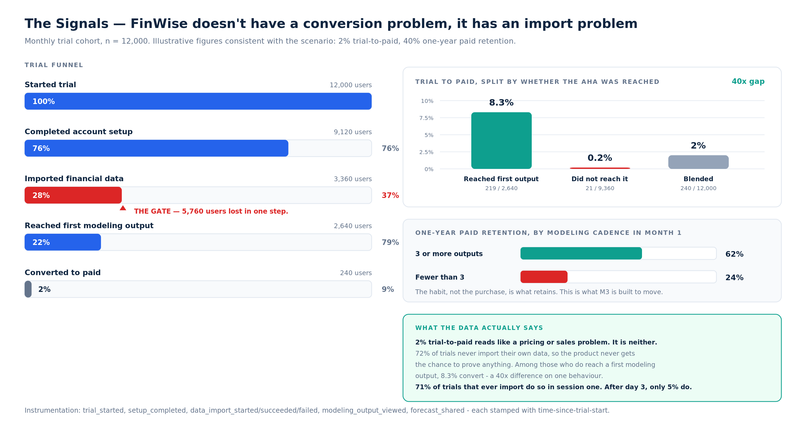

# The Signals · FinWise

> Module 4 · Data & Analytics. FinWise's metrics priority via **Aim · Move · Prove**, the pattern in the data, and whether the chosen leading indicator actually correlates with conversion.

**Data:** monthly trial cohort, n = 12,000. Illustrative figures, constructed to be consistent with the scenario's known facts (2% trial→paid, 40% one-year retention, $10M ARR).

## Metrics priority — Aim · Move · Prove

Carried over from M1: the hypothesis is that trial users never import their own data, and the biggest funnel drop-off is at the import step.

| Layer | Metric | Why (one sentence) |
|---|---|---|
| 🎯 **Aim · North Star** | Trial users who import financial data and reach their first modelling output | The single behaviour that proves a user has felt FinWise's core value. |
| ⚙️ **Move · Leading 1** | % of trials importing financial data within 48h | It is the gate itself — the step where 5,760 of 12,000 users are lost, and the one the M2 redesign targets. |
| ⚙️ **Move · Leading 2** | Median time from trial start to first modelling output | Distinguishes "eventually got there" from "got there while intent was still high"; the 48h window is decided in minutes, not days. |
| ⚙️ **Move · Leading 3** | Weekly forecast refresh rate in trial weeks 1–2 | Predicts whether activation becomes a habit, which is what the M3 mechanic is built to move. |
| ⚙️ **Move · Leading 4** | Import success rate (attempted vs completed) | Separates *unwilling* from *unable*; a connector failure and a trust objection need opposite fixes. |
| 📈 **Prove · Lagging 1** | Trial → paid conversion (2% → 8%) | The headline commercial result the strategy is judged on. |
| 📈 **Prove · Lagging 2** | One-year paid retention (40% → 55%) | Proves the habit held, not just that the sale closed. |
| 📈 **Prove · Lagging 3** | Share of new trials arriving via share/invite, not paid | Proves the growth loop is compounding and CAC dependence is falling. |

**The relationship in one line:** we manage the Move metrics and audit the Prove metrics. A lagging metric can be reported but never directly moved — every attempt to "improve conversion" without a leading mechanism is a wish, not a plan.

## The data pattern



### The funnel

| Stage | Users | % of trials | Step conversion |
|---|---|---|---|
| Started trial | 12,000 | 100% | — |
| Completed account setup | 9,120 | 76% | 76% |
| **Imported financial data** | **3,360** | **28%** | **37%** ← |
| Reached first modelling output | 2,640 | 22% | 79% |
| Converted to paid | 240 | 2% | 9% |

The largest drop is not sign-up and not conversion — it's the import, where **5,760 users are lost in a single step**.

### Does the leading indicator actually correlate with conversion?

This is the test that decides whether Leading 1 deserves to be Leading 1.

| Cohort | Users | Converted | Trial → paid |
|---|---|---|---|
| Reached first modelling output | 2,640 | 219 | **8.3%** |
| Did not reach it | 9,360 | 21 | **0.2%** |
| Blended | 12,000 | 240 | 2.0% |

**A 40× difference on one behaviour.** The blended 2% is an average of two populations that behave nothing alike, which is exactly why the headline metric was uninformative.

### And it predicts retention too

| Modelling outputs in month 1 | One-year paid retention |
|---|---|
| 3 or more | **62%** |
| Fewer than 3 | **24%** |
| Blended | 40% |

The same behaviour explains both of FinWise's problems. The trial doesn't convert because the output never happens; the customer churns because it never happened *repeatedly*.

### The timing detail that decides where the fix goes

**71% of trials that ever import do so in the first session.** After day 3, only 5% ever import at all.

That reassigns the whole problem. If imports trickled in across the trial, the lever would be lifecycle email and in-app nudges. They don't — the outcome is effectively settled in session one, which puts the lever in onboarding ([M2](../02-solution/activation-solution.md)) and nowhere else.

### The pattern stated plainly

> **FinWise doesn't have a conversion problem, it has an import problem that presents as a conversion problem.** 72% of trials never give the product the chance to prove anything, and it's decided in the first session. The 2% conversion rate isn't measuring willingness to pay — it's measuring how few users ever saw the product work.

**Correlation caveat, stated honestly.** Motivated users may both import their data *and* convert, so some of this gap is selection rather than causation. A 40× spread is far too large to be selection alone, but the honest position is that this is correlational evidence used to *generate* a hypothesis. Establishing causation is the job of the [M5 experiment](../05-validation/experiment-brief.md) — which is why the bet gets tested before it gets rolled out.

## Counter-metrics

Watched specifically because they would reveal that we won the number and lost the point:

- **Sample-data forecasts viewed.** If this rises, we've inflated "users who saw an output" without anyone modelling their own business — the most seductive way to fake activation here.
- **Imports started but abandoned.** Rising means we pushed harder on the ask without reducing the friction or the fear behind it.
- **Support tickets tagged `import` per 100 trials.** Throughput bought with confusion.

## Instrumentation required

```
trial_started            { source, campaign, decision_selected }
setup_completed          { seconds_since_trial_start }
data_import_started      { method: quickbooks | xero | csv | sample }
data_import_succeeded    { method, months_of_history, seconds_since_trial_start }
data_import_failed       { method, error_code }
modeling_output_viewed   { output_type, is_sample_data, seconds_since_trial_start }
forecast_refreshed       { confidence_before, confidence_after }
forecast_shared          { recipient_type: accountant | cofounder | bank }
```

Two of these carry the whole analysis. Without `seconds_since_trial_start` the 48-hour window isn't queryable, and without `is_sample_data` the North Star can be inflated by users who modelled nobody's business.
