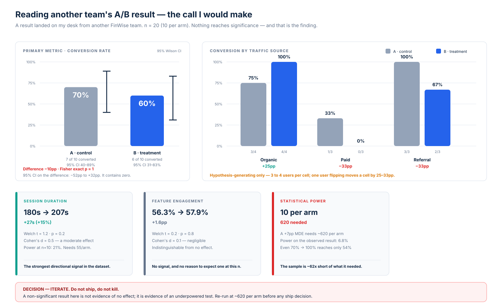

# Reading Another Team's Result

> Module 5, part 2 · Experimentation Methods. A result from another FinWise team landed on my desk. This is the call I would make on it.

**Context:** this is *not* the experiment I designed in [`experiment-brief.md`](experiment-brief.md). Another team ran an A/B test, the result arrived, and my job is to load it, read it, and make a defensible call — including the call that no call can be made.

**Data:** [`data/ab_test_experiment_data.csv`](data/ab_test_experiment_data.csv) · **Reproduce:** [`analysis.py`](analysis.py) · **n = 20** (10 per arm)

**Variables provided:** `Version` (A/B), `Traffic Source`, `Session Duration (s)`, `Conversion` (0/1), `Feature Engagement (%)`.

---

## Headline

**No metric in this test reaches significance, and the primary metric moved in the wrong direction.** Version B converted 6 of 10 versus A's 7 of 10.

The tempting readouts are both wrong:

- ❌ *"B lost — kill it."* One user is the entire difference. Flip a single conversion in arm B and the arms tie.
- ❌ *"B wins for organic traffic — ship it there."* That cell contains four users.

**The correct readout is that this test cannot answer the question it was asked.** That's a finding about the test, not about the product, and it's the only conclusion the data supports.

---

## Primary metric — conversion

| Arm | Converted | Rate | 95% Wilson CI |
|---|---|---|---|
| A · control | 7 / 10 | 70% | 40% – 89% |
| B · treatment | 6 / 10 | 60% | 31% – 83% |

- **Difference:** −10pp
- **Fisher exact p = 1.00** (χ² p = 0.64)
- **95% CI on the difference: −52pp to +32pp**

That interval is the whole story. It contains zero, it contains a catastrophic 50-point regression, and it contains a 30-point improvement that would be the best result in FinWise's history. An estimate consistent with all three outcomes has told us nothing.

### Fragility

| Scenario | Arm B rate | Conclusion the data would "support" |
|---|---|---|
| As observed | 60% | B is worse |
| One more converter | 70% | No difference |
| Two more converters | 80% | B is better |

Three completely different product decisions separated by two users. Any readout this fragile is noise.

---

## The actual finding: this test was never capable of detecting the effect

| | |
|---|---|
| Sample required to detect a +7pp lift on this baseline | **620 per arm** (1,240 total) |
| Sample actually run | **10 per arm** (20 total) |
| Shortfall | **~62×** |
| Power to detect the observed −10pp | **6.8%** |
| Power even if B had converted at 100% | **54.4%** |

The last row is the one that settles it. Even if the treatment had converted **every single user** — a 30-point jump that no onboarding redesign has ever produced — this test would still have failed to reach significance roughly half the time.

> **A non-significant result at n=20 is not evidence of no effect. It is evidence of an underpowered test.** Absence of evidence and evidence of absence are different claims, and only the first one is available here.

Reading a −10pp "regression" from this sample and killing the feature would be a Type II error dressed up as rigour.

---

## Secondary metrics

| Metric | A | B | Δ | Welch t | p | Cohen's d |
|---|---|---|---|---|---|---|
| Session duration (s) | 180.0 | 207.0 | **+27.0 (+15%)** | 1.20 | 0.25 | **0.54** |
| Feature engagement (%) | 56.3 | 57.9 | +1.6 | 0.23 | 0.83 | 0.10 |

**Session duration is the most interesting number in the dataset**, and not because of its p-value. A Cohen's d of 0.54 is a moderate effect — the kind of effect worth chasing. It fails significance because n=10 gives it only **21% power**; detecting d = 0.54 reliably needs **55 per arm**, which is an order of magnitude cheaper than the conversion test.

This is exactly why effect size matters more than p-value in an underpowered test. p = 0.25 with d = 0.54 says "possibly real, badly measured." p = 0.83 with d = 0.10 (engagement) says "probably nothing there."

There's also an ambiguity worth flagging: a longer session can mean deeper engagement *or* more struggle. Without knowing what the other team changed, +15% session duration is not self-evidently good news — a longer flow that doesn't convert better is a warning sign as easily as a win. I'd want the variant spec before interpreting it either way.

---

## Segment analysis — hypothesis-generating only

| Traffic source | A | B | Δ | Cell size |
|---|---|---|---|---|
| Organic | 75% (3/4) | 100% (4/4) | **+25pp** | 4 per arm |
| Paid | 33% (1/3) | 0% (0/3) | **−33pp** | 3 per arm |
| Referral | 100% (3/3) | 67% (2/3) | **−33pp** | 3 per arm |

**These are not findings.** With three to four users per cell, a single person changes any cell by 25–33pp, and the Organic cell has power of roughly 21% for even the enormous swing it appears to show. Reporting these as segment wins would be the textbook error of slicing an underpowered test until something looks significant — with three segments, a spurious "winner" is close to guaranteed.

What they are worth is a **pre-registered hypothesis for the next test**:

> *The treatment helps high-intent (organic) arrivals and may hurt low-intent (paid) arrivals, because organic users already believe in the problem while paid users need more persuasion before a heavy ask.*

That is a genuinely testable idea, and it's plausible enough to be worth the cost of testing. It is not a reason to change anything today. **This test generated it; it did not confirm it.**

---

## Validity checks

| Check | Result | Read |
|---|---|---|
| Sample ratio | 10 / 10 | Balanced, no SRM |
| Traffic source mix | 4/3/3 in **both** arms | See note below |
| Metric definitions | Consistent across arms | Clean |
| Novelty effect | **Not checkable** | No timestamps in the dataset |
| Day-of-week effects | **Not checkable** | No dates in the dataset |

**On the perfectly matched source mix:** both arms contain exactly 4 organic, 3 paid and 3 referral users. Simple randomisation would rarely produce an exact match. Either assignment was stratified by traffic source — which is good practice and should be documented — or this is a constructed sample. Worth confirming before the next run, since it changes which analysis is correct.

**On the control conversion rate:** arm A converted at 70%, which is nowhere near FinWise's 2% trial→paid baseline. Either this test measures a different, much narrower conversion event than trial→paid, or the sample is not drawn from the general trial population. Before acting on any of it I'd want that definition confirmed — a metric you can't name is a metric you can't ship on.

---

## Decision, against the rules written before the data

Applying the same decision framework I pre-registered in my own [brief](experiment-brief.md) — primary metric directionally negative, not significant, no guardrail breach — the call is:

> **ITERATE. Do not ship, do not kill.**

Holding to that is harder than it sounds, because the temptation runs both ways. The negative direction invites killing the idea; the Organic cell invites shipping it to one segment. A framework decided in advance is what stops twenty users from settling either question — and it would have applied identically had the numbers landed the other way.

### Next steps

1. **Re-run at ~620 per arm.** At FinWise's ~400 trials/day that's under a week of enrollment. This is an ordinary test that was simply run at the wrong scale.
2. **Stratify by traffic source and pre-register the segment hypothesis** — organic positive, paid negative. Declaring it in advance is the difference between testing it and fishing for it.
3. **Promote session duration to a tracked secondary** with a directional prediction, since d = 0.54 is worth 55 users per arm to resolve.
4. **Add timestamps** (`assigned_at`, `converted_at`) so novelty decay and day-of-week effects become checkable at all.
5. **Confirm what `Conversion` actually measures** and what the treatment changed, before anyone quotes a number from this.
6. **Do not change the onboarding, the pricing, or anything else on the strength of this readout.**

---

## What I'd tell the room in one line

> This test was run at the wrong sample size, so it tells us nothing — which is still cheaper than shipping on it would have been. Re-run at 620 per arm and you'll have a real answer inside a week. Until then, nobody should quote the −10pp.
